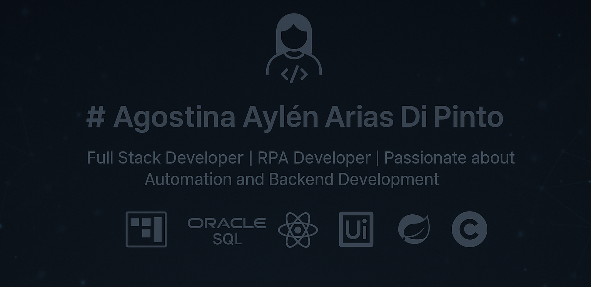

# 👩‍💻 Agostina Arias Di Pinto

Hi there! I'm Agostina — a developer with a background in **RPA**, **C**, **C#**, and tools like **UiPath**, **Power Automate**, **Spring Boot**, and **React**. I'm currently studying at [42 Málaga](https://42malaga.com/) and working in intelligent process automation and data-driven solutions.

---

## 🚀 Tech Stack

- 🧠 **Languages**: C, C#, Python, Java, JavaScript, SQL  
- ⚙️ **Automation**: UiPath, Power Automate, Appian, Selenium  
- 🗃️ **Databases**: Oracle SQL, SQL Server, MySQL  
- ☁️ **Cloud & DevOps**: Azure, Git, GitHub  
- 🌐 **Web Development**: HTML, CSS, React, Spring Boot  

---

## 🎓 Education

- 🏫 Software Engineering Student at [42 Málaga](https://42malaga.com/)  
- 📊 Certified in Data Analysis and Full Stack Java Development  
- 🧬 Pediatric Nephrologist with expertise in Clinical Management and AI in Medicine  

---

## 📊 42 Stats

---

## 📫 Get in Touch

- 🌍 [LinkedIn](https://www.linkedin.com/in/agosarias/)  
- 🧠 [GitHub](https://github.com/AgosArias)  
- 📧 agosarias.dev@gmail.com  

---

> “Creativity is intelligence having fun.” – Albert Einstein
